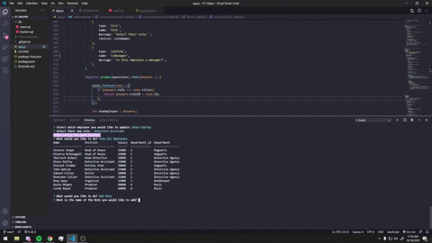
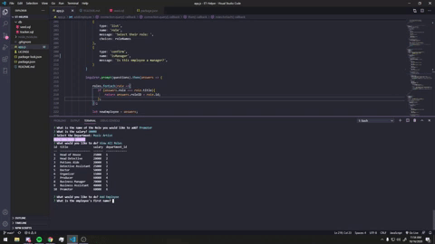

# Employee-Tracker

## Table of Contents 
* [Description](#Description)
* [Installation](#Installation)
* [Features](#Usage)
* [Coming Soon](#Coming-Soon)
* [Extended Reading](#Extended-Reading)
* [Contributors](#Contributors)
* [License](#License)

## Description
Keeping track of your employees can be difficult. What if there was an app that removed some of the stress and allowed you to easily add new employees, and update current ones. With ET Helper, users are able to UPDATE employee roles, and VIEW all employees, roles, and departments within their business. 

## Installation
In order to utilize this application you must have the following packages installed: 
* Inquirer
* MySQL

To download a free MySQL database, click [here](https://www.mysql.com/downloads/).

To install inquirer: 
```
npm i inquirer
```

To install MySQL as an npm package: 
```
npm i mysql
```

In order to begin using the app, run the start script in the cmd line: 
```
npm start
```
or 

```
node app.js
```
In the app.js source file, be sure it to type your password in to connect to your database on PORT 3306. 
```
//creates connection 
const connection = mysql.createConnection({
    host: 'localhost', 

    port: 3306, 

    user: 'root', 

    password: 'password', 

    database: 'employee_tracker',

    insecureAuth: true
}); 
```
## Features 
To watch a video demoing the features of this app, click [here](https://www.youtube.com/watch?v=qu1k8YYp39E&feature=youtu.be). 

Features included in this application: 
- [ x ] UPDATE your employee's role 
- [ x ] ADD departments, roles, and new employees
- [ x ] VIEW all roles, departments, and employees in your database 




## Coming Soon 
- [ ] VIEW employees by manager
- [ ] UPDATE employee manager
- [ ] UPDATE departments 
- [ ] DELETE departments, roles, and employees

## Extended Reading
Follow the links to learn more about the packages and technologies used in making this project: 
* [MySQL and NodeJS](https://www.w3schools.com/nodejs/nodejs_mysql.asp)
* [Inquirer](https://www.npmjs.com/package/inquirer)


## Contributors 
This project was created by Kelsey Hughes. You can view more of their projects on their GitHub profile [here](https://www.github.com/kelbri10).

## License 
This project is under the MIT license. 